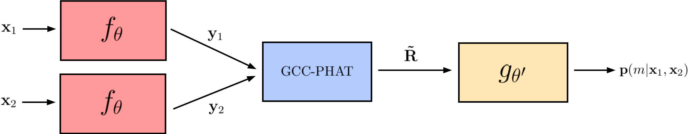

# Neural Generalized Cross Correlations (NGCC)



This is the official implementation of [*Extending GCC-PHAT using Shift Equivariant Neural Networks*](https://arxiv.org/abs/2208.04654), published in Interspeech 2022. We propose a neural GCC-PHAT (NGCC-PHAT). The signals are passed through a convolutional network that outputs multiple filtered versions of the signals. Several GCC-PHAT correlations are then computed and combined into a single probability distribution.

For a quick start on how to use NGCCPHAT for TDOA estimation and positioning, try out the notebook [tdoa_example.ipynb](tdoa_example.ipynb)

## Dependencies

To install the required dependencies use `pip install -r requirements.txt`

## Room simulation

Signal propagation is simulated using [pyroomacoustics](https://github.com/LCAV/pyroomacoustics). At each simulation, a room with the specified dimensions is created with the speaker in the specified position. Two microphones are then placed randomly inside the room and the acoustic waveform is propagated from the speaker to the microphones, such that the received signals will be noisy copies of the original signal. The acoustic conditions are controlled by two parameters: the reverberation time (T60) and the signal to noise ratio (SNR).

## Dataset

The LibriSpeech dataset contains recordings of English audiobooks in 16 kHz. For our experiments, we use recordings from the `test-clean` split which can be downloaded from https://www.openslr.org/12. Each recording is pruned from silent parts and recordings shorter than two seconds are removed. At training time, a randomly selected time window of 2048 samples is extracted and transmitted from the speaker position to each microphone. For reproducibility, all 15 time windows are used for each snippet at test time.

Note that each recording is marked with a speaker id. We use recordings from three randomly selected speakers for training and validation respectively. The remaining 40 speakers are used for training.

The dataset will be automatically downloaded the first time the training/evaluation script is run.

## Training a model from scratch

To set up an experiment, first have a look at the configuration parameters in [cfg.py](cfg.py). Once everything is set up, you can train your own model by running

```
python main.py --exp_name=name_of_my_experiment
```

The training will run on a single GPU, if available. During training, both SNR and T60 is randomized within the provided intervals. Note that training time increases with the reverberation time T60. In order to train faster, try reducing the T60 range.

## Pre-trained models

A pre-trained model is provided in [experiments/ngccphat](experiments/ngccphat), which was trained with the default parameters in the config file. To evaluate in the test room, run

```
python main.py --evaluate --exp_name=ngccphat
```

The log will output the MAE, RMSE and accuracy for the model and GCC-PHAT. For further analysis, all the ground truth delays and model predictions are stored in an `.npz` file as well.

## Citation

If you use this code repository, please cite the following paper:

```
@inproceedings{berg22_interspeech,
  author={Axel Berg and Mark O'Connor and Kalle Åström and Magnus Oskarsson},
  title={{Extending GCC-PHAT using Shift Equivariant Neural Networks}},
  year=2022,
  booktitle={Proc. Interspeech 2022},
  pages={1791--1795},
  doi={10.21437/Interspeech.2022-524}
}
```

## Acknowledgements

The network backbone is borrowed from SincNet and we thank the authors for sharing their code with the community. The original repository is found [here](https://github.com/mravanelli/SincNet).

The PGCC-PHAT implementation is based on the description in the paper ["Time Delay Estimation for Speaker Localization Using CNN-Based Parametrized GCC-PHAT Features"](https://www.isca-speech.org/archive/pdfs/interspeech_2021/salvati21_interspeech.pdf) by Salvati et al.
